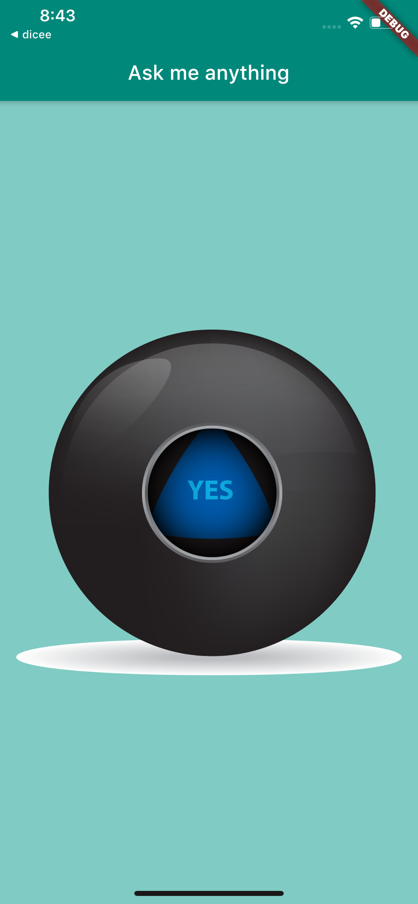
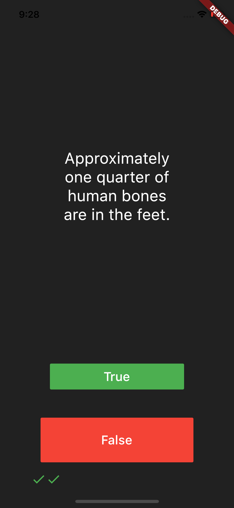
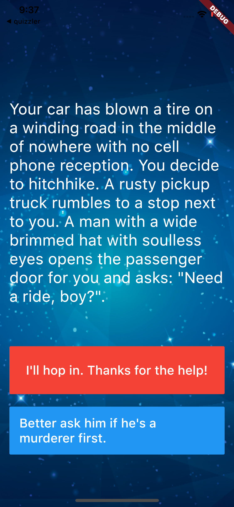
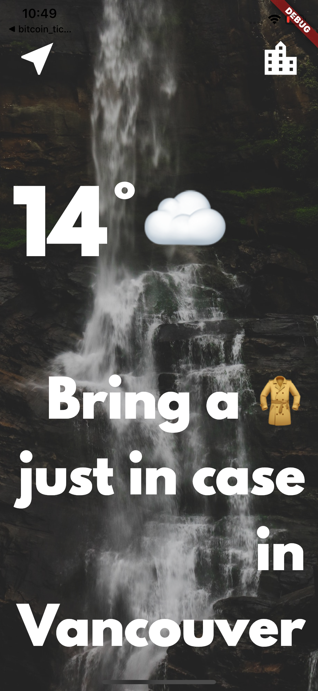
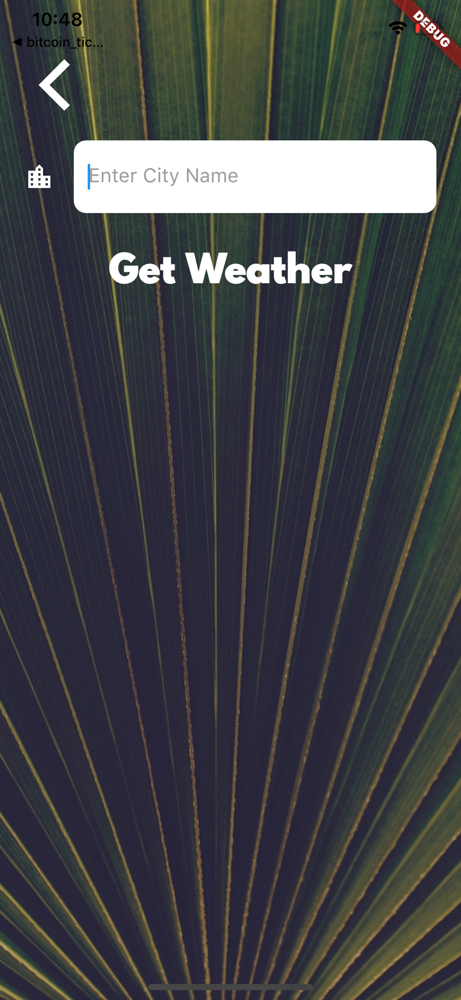
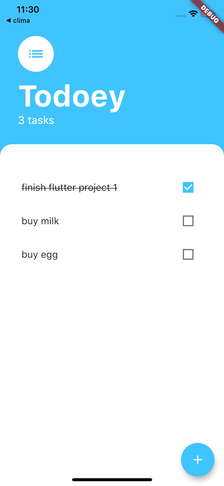
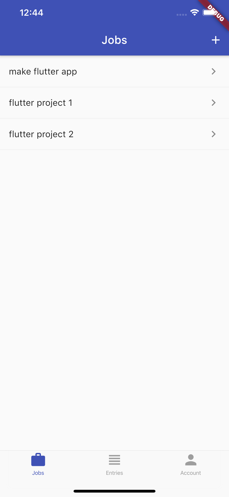

# Flutter-App-Projects (for code, please click on each project link)
This repository includes all of my sample Flutter App projects as the Step 1 to show my learning jouney. 

All the apps are beautifully made and fully functional. Each app is in a separate project(repository), with click to the specific project link. The order of the list is based on comlexity level, first one as a starter project and the last one as more complicated one, however each project covers different topic and skills on developing Flutter App. (Please note for some apps I removed API keys, you need to add your own key to run the app successfully).

I learnt to make most of the apps in this repository from London App Brewery, and all the code in each project includes my own learning notes.

For more unique and more complexed Apps, please see my other repositories. 

## Flutter App 1: (project link) <a href="https://github.com/lutang123/business_card_flutter">Business Card</a>

 

## Flutter App 2: <a href="https://github.com/lutang123/dicee-game-flutter">Dicee Game</a>

Final Result image, random number with random color on tap:

  
   
  
  
  

## Flutter App 3: <a href="https://github.com/lutang123/magic-8-ball-flutter-v2">Magic Ball</a>

 

## Flutter App 4: <a href="https://github.com/lutang123/xylophone-flutter">Xylophone</a>

## Flutter App 5: <a href="https://github.com/lutang123/quizzler-flutter">Quizzler</a>

## Flutter App 6: <a href="https://github.com/lutang123/destini-flutter">Destini</a>

## Flutter App 7: <a href="https://github.com/lutang123/bmi-calculator-flutter">BMI Calculator</a>

  
   

## Flutter App 8: <a href="https://github.com/lutang123/clima-flutter">Clima</a>

  
   

## Flutter App 9: <a href="https://github.com/lutang123/coin-tracker">Bitcoin Tracker</a>

## Flutter App 10: <a href="https://github.com/lutang123/Flash-chat">Flash Chat</a>

## Flutter App 11: <a href="https://github.com/lutang123/todoey">Todoey</a>

  
   

## Flutter App 12: <a href="https://github.com/lutang123/Timer-Tracker-Flutter">Todoey</a>

  
   
  
  
  
  

