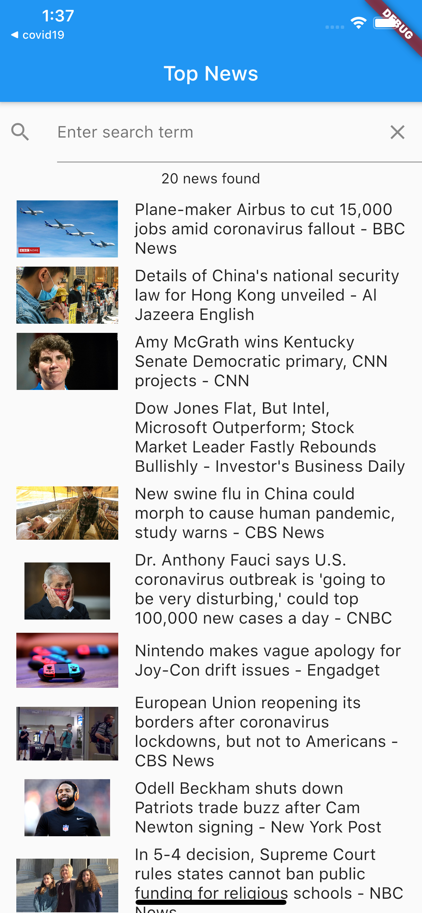
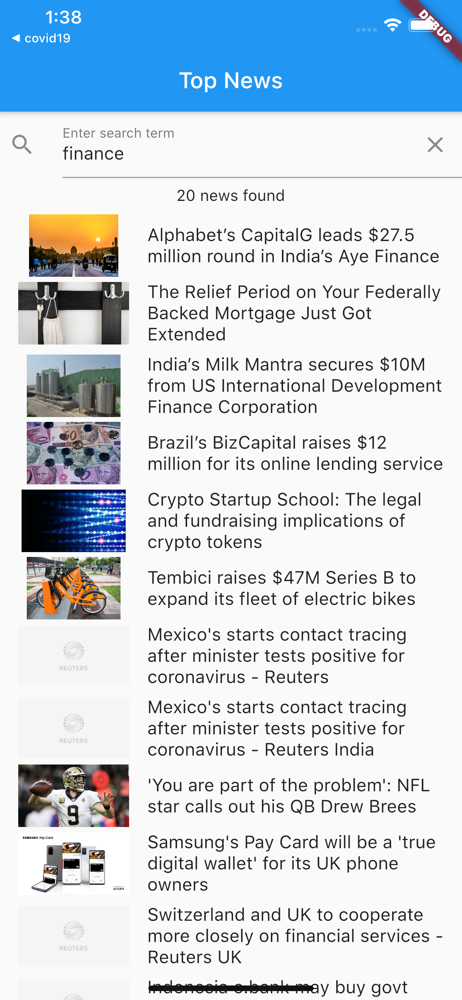
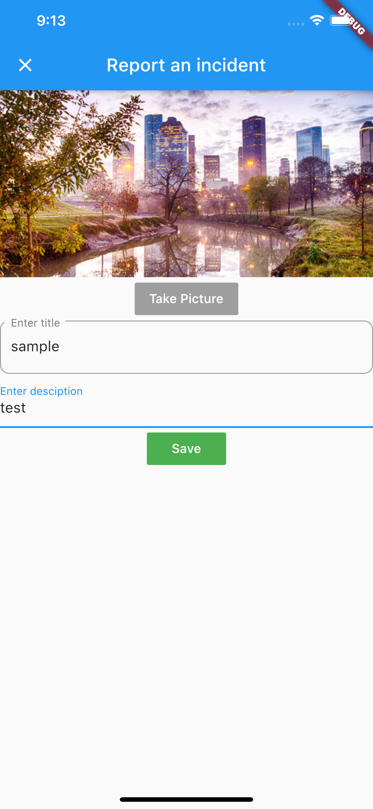
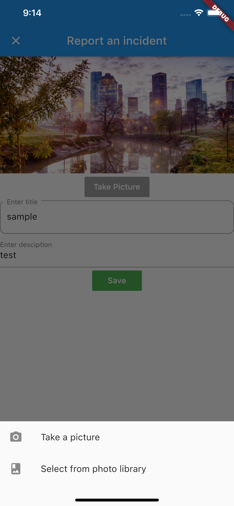
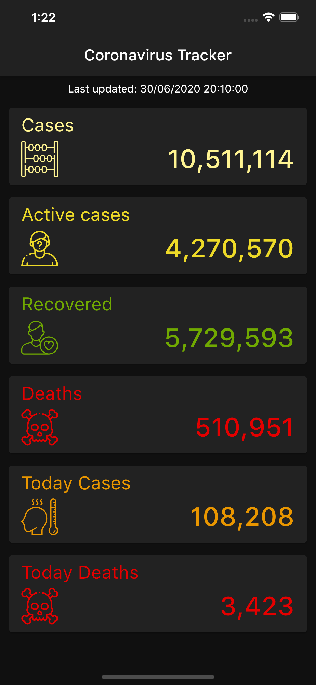
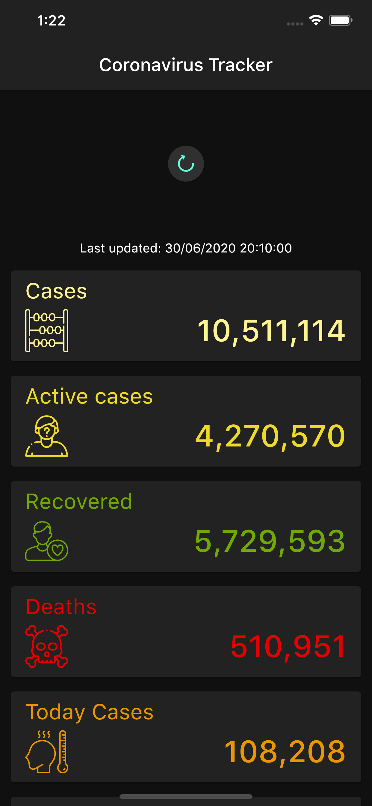

# Flutter-App-Projects (for code, please click on each project link)

This repository includes most of my sample Flutter App projects. 

All the apps are beautifully made and fully functional. Each app is in a separate project(repository), with click to the specific project link. 

The order of the list is based on comlexity level: first one as a starter project and the last one as more complicated one; each project covers different topic and skills on developing Flutter App. 

All the code includes my own notes, also for some apps I removed API keys, you need to add your own key to run the app successfully.

## Flutter App 1: (project link) <a href="https://github.com/lutang123/business_card_flutter">Business Card</a>

 

## Flutter App 2: <a href="https://github.com/lutang123/dicee-game-flutter">Dicee Game</a>
On tap to change dicee number as well as background color.

  
   
  
  
  

## Flutter App 3: <a href="https://github.com/lutang123/magic-8-ball-flutter-v2">Magic Ball</a>
Can't make decisions? tap to ask me for anything.

 

## Flutter App 4: <a href="https://github.com/lutang123/xylophone-flutter">Xylophone</a>
Each row plays a different sound on tap, perfect for kids to play.

## Flutter App 5: <a href="https://github.com/lutang123/quizzler-flutter">Quizzler</a>
A quiz app.

## Flutter App 6: <a href="https://github.com/lutang123/destini-flutter">Destini</a>
Story game.

## Flutter App 7: <a href="https://github.com/lutang123/bmi-calculator-flutter">BMI Calculator</a>

  
   

## Flutter App 8: <a href="https://github.com/lutang123/clima-flutter">Clima</a>

  
   

## Flutter App 9: <a href="https://github.com/lutang123/coin-tracker">Bitcoin Tracker</a>

## Flutter App 10: <a href="https://github.com/lutang123/Flash-chat">Flash Chat</a>

## Flutter App 11: <a href="https://github.com/lutang123/todoey">Todoey</a>

  
   

## Flutter App 12: <a href="https://github.com/lutang123/todo-list-app-with-SQLite">TodoList Appp with SQLite</a>

  
   
   

## Flutter App 13: <a href="https://github.com/lutang123/Top-News">Top News</a>

  
   

## Flutter App 14: <a href="https://github.com/lutang123/City-Care">City Care</a>

A flutter app that can take or select pictures and send accident report.

  
   

## Flutter App 15: <a href="https://github.com/lutang123/Covid19-app">Covid19 App</a>

  
   

## Flutter App 16: <a href="https://github.com/lutang123/Timer-Tracker-Flutter">Time Tracker</a>

  
   
  
  
  
  

## Flutter App 17: <a href="https://github.com/lutang123/iMomentum">iMomentum</a>
A beautiful Flutter App with Calendar, Task list, Pomodoro Timer and Notes, all in one! The App is designed to provide inspiration, positivity and to help boost productivity and eliminate distraction with daily focus report, changing background picture, daily quote, mantra and customizable displays.

  
   
  
  
  
  
  

