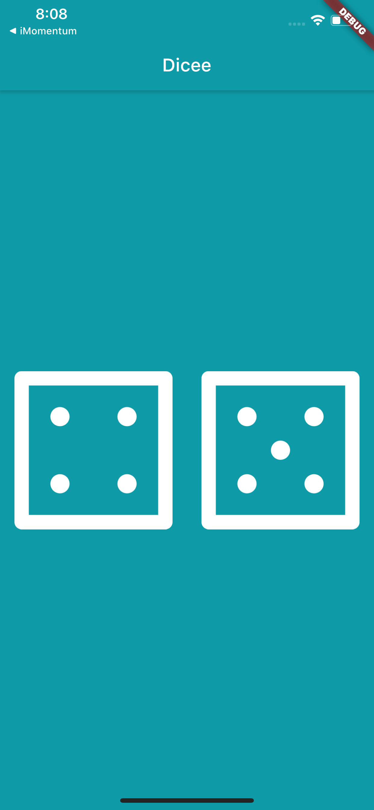
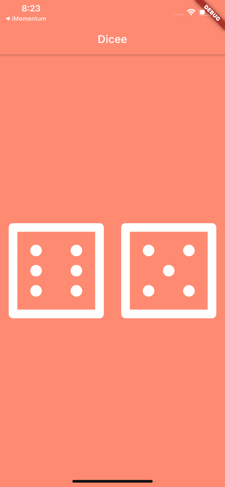

# Flutter-App-Projects
This repository includes all of my sample Flutter App Projects, the order of the list is based on comlexity level, first one as a starter project and the last one as more complicated one. However, for more complexed app, please see my other repositories. 

## Flutter App 1: 

Project link: <a href="https://github.com/lutang123/business_card_flutter">Business Card</a>

 

## Flutter App 2:

Project link: <a href="https://github.com/lutang123/dicee-game-flutter">Dicee Game</a>

# Dicee 🎲

Every time when you tap on any dicee, you will get a new number on both dicee and a new color, there're ten plus colors available for this game, more fun to play. 

For detailed code, see the folder lib, "lib/main.dart"

## Final Result image, random number with random color on tap:

  
   
  
  
  

